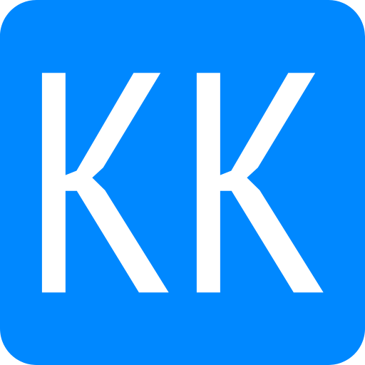

import vsDark from 'prism-react-renderer/themes/vsDark';


# Using Gatsby and AWS CDK to create my new Blogs Website



This repository contains example code for a CDK Pipeline which integrates with `sam local` based testing for Lambda functions.

# The Flow

[![enter image description here][1]][1]

# Stages

## Source
[![enter image description here][2]][2]

export const exampleCode = `cdk_codepipeline = pipelines.CodePipeline(
    self,
    "Pipeline",
    synth=pipelines.ShellStep(
        "Synth",
        input=source,
        install_commands=[
            "pip install -r requirements.txt",
            "npm install -g aws-cdk",
        ],
        commands=[
            "cdk synth",
        ],
    ),
)`;

<CodeHighlight theme={vsDark} code={exampleCode} language="python" />

The source code repository is configured using CodeStar connections. The connection was done manually beforehand, and I am getting the ARN from SSM parameter store.


## Build, SelfMutate and UploadAssets
[![enter image description here][3]][3]
[![enter image description here][4]][4]
[![enter image description here][5]][5]
``` lang-python
cdk_codepipeline = pipelines.CodePipeline(
    self,
    "Pipeline",
    synth=pipelines.ShellStep(
        "Synth",
        input=source,
        install_commands=[
            "pip install -r requirements.txt",
            "npm install -g aws-cdk",
        ],
        commands=[
            "cdk synth",
        ],
    ),
)
```
- The Synth stage is used to synthesize the CDK code into CloudFormation templates.
- The SelfMutate stage is a CDK feature to update the pipeline inside the pipeline itself. This allows you to make changes to your pipeline even after the initial deployment.
- The Assets stage uploads all cdk assets to their destinations, using the cdk-assets command. Since I have separated my stacks into two separate stages, each one gets its own assets upload step.

In case you are not using CDK Pipelines, here is the build spec for all stages:

For Synth:
``` lang-json
{
  "version": "0.2",
  "phases": {
    "install": {
      "commands": [
        "pip install -r requirements.txt",
        "npm install -g aws-cdk"
      ]
    },
    "build": {
      "commands": [
        "cdk synth"
      ]
    }
  },
  "artifacts": {
    "base-directory": "cdk.out",
    "files": "**/*"
  }
}
```

For SelfMutate:
``` lang-json
{
  "version": "0.2",
  "phases": {
    "install": {
      "commands": [
        "npm install -g aws-cdk"
      ]
    },
    "build": {
      "commands": [
        "cdk -a . deploy PipelineStack --require-approval=never --verbose"
      ]
    }
  }
}
```

For Assets:
``` lang-json
{
  "version": "0.2",
  "phases": {
    "install": {
      "commands": [
        "npm install -g cdk-assets"
      ]
    },
    "build": {
      "commands": [
        "cdk-assets --path \"assembly-LambdaStage/LambdaStageLambdasStackABCD123.assets.json\" --verbose publish \"longrandomstring:current_account-current_region\""
      ]
    }
  }
}
```

## Unit Testing
``` lang-python
testing = pipelines.CodeBuildStep(
    "UnitTesting",
    input=source,
    install_commands=[
        "pip install -r requirements.txt -r requirements-dev.txt",
    ],
    commands=[
        "pytest --cov",
    ],
    env={
        "QUEUE_URL": "SampleQueue",
        "TABLE_NAME": "SampleTest",
    },
    build_environment=codebuild.BuildEnvironment(
        build_image=codebuild.LinuxBuildImage.STANDARD_5_0,
        privileged=True,
        compute_type=codebuild.ComputeType.SMALL,
    ),
)
```
This is a simple step, which runs any unit tests in your code.


In case you are not using CDK Pipelines, here is the build spec:
``` lang-json
{
  "version": "0.2",
  "phases": {
    "install": {
      "commands": [
        "pip install -r requirements.txt -r requirements-dev.txt"
      ]
    },
    "build": {
      "commands": [
        "pytest --cov"
      ]
    }
  }
}
```


## Deploy Supporting resources
[![enter image description here][6]][6]
``` lang-python
cdk_codepipeline.add_stage(
    supporting_resources_stage,
    pre=[
        testing,
        pipelines.ConfirmPermissionsBroadening(
            "CheckSupporting", stage=supporting_resources_stage
        ),
    ],
)
```
This would deploy the supporting resources, which are required for your `sam local` tests to run properly. The permissions broadening step stops the pipeline and forces manual approval in case of any broadening of IAM permissions. You can add unit testing in its own separate stage as well.

In case you are not using CDK Pipelines, here is the build spec:
``` lang-json
{
  "version": 0.2,
  "phases": {
    "build": {
      "commands": [
        "npm install -g aws-cdk",
        "export PIPELINE_NAME=\"$(node -pe '`${process.env.CODEBUILD_INITIATOR}`.split(\"/\")[1]')\"",
        "payload=\"$(node -pe 'JSON.stringify({ \"PipelineName\": process.env.PIPELINE_NAME, \"StageName\": process.env.STAGE_NAME, \"ActionName\": process.env.ACTION_NAME })' )\"",
        "ARN=$CODEBUILD_BUILD_ARN",
        "REGION=\"$(node -pe '`${process.env.ARN}`.split(\":\")[3]')\"",
        "ACCOUNT_ID=\"$(node -pe '`${process.env.ARN}`.split(\":\")[4]')\"",
        "PROJECT_NAME=\"$(node -pe '`${process.env.ARN}`.split(\":\")[5].split(\"/\")[1]')\"",
        "PROJECT_ID=\"$(node -pe '`${process.env.ARN}`.split(\":\")[6]')\"",
        "export LINK=\"https://$REGION.console.aws.amazon.com/codesuite/codebuild/$ACCOUNT_ID/projects/$PROJECT_NAME/build/$PROJECT_NAME:$PROJECT_ID/?region=$REGION\"",
        "export PIPELINE_LINK=\"https://$REGION.console.aws.amazon.com/codesuite/codepipeline/pipelines/$PIPELINE_NAME/view?region=$REGION\"",
        "if cdk diff -a . --security-only --fail $STAGE_PATH/\\*; then aws lambda invoke --function-name PipelineStack-PipelinePipelinesSecurityCheckCDKalpha-numeric --invocation-type Event --payload \"$payload\" lambda.out; export MESSAGE=\"No security-impacting changes detected.\"; else [ -z \"${NOTIFICATION_ARN}\" ] || aws sns publish --topic-arn $NOTIFICATION_ARN --subject \"$NOTIFICATION_SUBJECT\" --message \"An upcoming change would broaden security changes in $PIPELINE_NAME.\nReview and approve the changes in CodePipeline to proceed with the deployment.\n\nReview the changes in CodeBuild:\n\n$LINK\n\nApprove the changes in CodePipeline (stage $STAGE_NAME, action $ACTION_NAME):\n\n$PIPELINE_LINK\"; export MESSAGE=\"Deployment would make security-impacting changes. Click the link below to inspect them, then click Approve if all changes are expected.\"; fi"
      ]
    }
  },
  "env": {
    "exported-variables": [
      "LINK",
      "MESSAGE"
    ]
  }
}
```

## sam local testing

``` lang-python
sam_cli_test_step = pipelines.CodeBuildStep(
    "SAMTesting",
    input=source,
    env_from_cfn_outputs={
        "QUEUE_URL": supporting_resources_stage.stack.queue_url,
        "TABLE_NAME": supporting_resources_stage.stack.table_name,
    },
    install_commands=[
        "pip install -r requirements.txt",
        "npm install -g aws-cdk",
        "mkdir testoutput",
    ],
    commands=[
        'cdk synth -a "python synth_lambdas_stack.py" -o sam.out',
        'echo "{\\""SqsLambdaFunction\\"": {\\""QUEUE_URL\\"": \\""$QUEUE_URL\\""},'
        + '\\""DynamodbLambdaFunction\\"": {\\""TABLE_NAME\\"": \\""$TABLE_NAME\\"" }}"'
        + " > locals.json",
        'sam local invoke -t "sam.out/LambdasStack.template.json" --env-vars locals.json'
        + ' --no-event "DynamodbLambdaFunction"',
        'sam local invoke -t "sam.out/LambdasStack.template.json" --env-vars locals.json'
        + ' --no-event "SqsLambdaFunction"',
        "nohup sam local start-api -t sam.out/LambdasStack.template.json"
        + " --env-vars locals.json > testoutput/testing.log & ",
        "",
        "sleep 30",
        "curl --fail http://127.0.0.1:3000/sqs",
        "curl --fail http://127.0.0.1:3000/dynamodb",
    ],
    build_environment=codebuild.BuildEnvironment(
        build_image=codebuild.LinuxBuildImage.STANDARD_5_0,
        privileged=True,
        compute_type=codebuild.ComputeType.SMALL,
    ),
    primary_output_directory="testoutput/",
    role_policy_statements=[
        iam.PolicyStatement(
            actions=[
                "sqs:SendMessage",
                "sqs:GetQueueAttributes",
                "sqs:GetQueueUrl",
            ],
            resources=["*"],
        ),
        iam.PolicyStatement(
            actions=[
                "dynamodb:BatchWriteItem",
                "dynamodb:PutItem",
                "dynamodb:UpdateItem",
                "dynamodb:DeleteItem",
            ],
            resources=["*"],
        ),
    ],
)
```
- In your supporting resources stack, you will need to define any parameters like resource names and ARNs which your Lambda code needs as stack outputs. I have provided these values to my Lambda function using environment variables.
- In my stack code, I have specified the logical ids of the CloudFormation Lambda function resource instead of relying on CDK's auto generated value.
``` lang-python
sqs_lambda_base: _lambda.CfnFunction = sqs_lambda.node.default_child
sqs_lambda_base.override_logical_id("SqsLambdaFunction")
```
- I have created a separate app file which only synthesizes my Lambda stack, instead of the full Pipeline stack. In theory you should be able to use the synth output of the full stack, but this is simpler to configure.
- I have added permissions needed by my Lambdas to interact with the resources created by my supporting resources stack.
- `sam-beta-cdk` can be used to simplify some of this workflow, but I did not use it here since it is still in preview.

In case you are not using CDK Pipelines, here is the build spec:
``` lang-json
{
  "version": "0.2",
  "phases": {
    "install": {
      "commands": [
        "pip install -r requirements.txt",
        "npm install -g aws-cdk",
        "curl --version",
        "mkdir testoutput"
      ]
    },
    "build": {
      "commands": [
        "cdk synth -a \"python synth_lambdas_stack.py\" -o sam.out",
        "echo \"{\\\"\"SqsLambdaFunction\\\"\": {\\\"\"QUEUE_URL\\\"\": \\\"\"$QUEUE_URL\\\"\"},\\\"\"DynamodbLambdaFunction\\\"\": {\\\"\"TABLE_NAME\\\"\": \\\"\"$TABLE_NAME\\\"\" }}\" > locals.json",
        "sam local invoke -t \"sam.out/LambdasStack.template.json\" --env-vars locals.json --no-event \"DynamodbLambdaFunction\"",
        "sam local invoke -t \"sam.out/LambdasStack.template.json\" --env-vars locals.json --no-event \"SqsLambdaFunction\"",
        "nohup sam local start-api -t sam.out/LambdasStack.template.json --env-vars locals.json > testoutput/testing.log & ",
        "",
        "sleep 30",
        "curl --fail http://127.0.0.1:3000/sqs",
        "curl --fail http://127.0.0.1:3000/dynamodb"
      ]
    }
  },
  "artifacts": {
    "base-directory": "testoutput/",
    "files": "**/*"
  }
}
```

## Deploy Lambda functions
[![enter image description here][7]][7]
``` lang-python
cdk_codepipeline.add_stage(
    lambdas_stage,
    pre=[
        sam_cli_test_step,
        pipelines.ConfirmPermissionsBroadening(
            "CheckLambda", stage=lambdas_stage
        ),
    ],
)
```
This is similar to the deploy supporting resources stage. You can add sam local testing in its own separate stage as well.

# Notes:
- DynamoDB specifically has support for [local testing][8] if you don't want to deploy it first. 
- While my pipeline only deploys one set of resources, you can create different stages deploying to different environments/accounts.
- The sam local testing step defined here is very simple. You can use features like API testing tools to run a whole suite of test cases. [Here][9] is an official AWS sample that uses selenium to test a web server, with the APIs running on sam local.

# Limitations
- API Gateway authorizers are [not supported][10] for `sam local` testing, so you won't be able to test Cognito authorizers if you are planning to use them.


  [1]: https://i.stack.imgur.com/zx46a.png
  [2]: https://i.stack.imgur.com/usJ06.png
  [3]: https://i.stack.imgur.com/Q2oK0.png
  [4]: https://i.stack.imgur.com/zusTr.png
  [5]: https://i.stack.imgur.com/bpjjo.png
  [6]: https://i.stack.imgur.com/GK0QY.png
  [7]: https://i.stack.imgur.com/5Ia1g.png
  [8]: https://docs.aws.amazon.com/amazondynamodb/latest/developerguide/DynamoDBLocal.html
  [9]: https://github.com/aws-samples/aws-codebuild-polyglot-application/blob/master/buildspec.yml
  [10]: https://github.com/aws/aws-sam-cli/issues/137