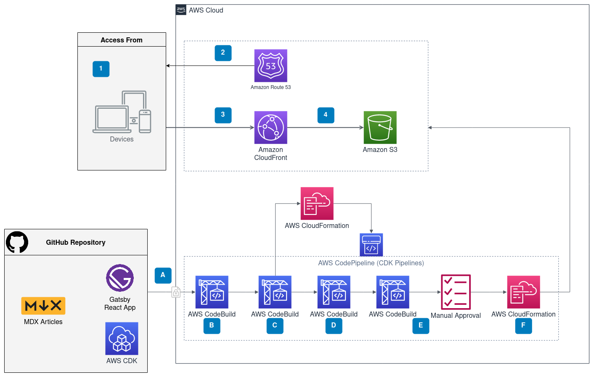

import Button from '@mui/material/Button';
import vsDark from 'prism-react-renderer/themes/vsDark';

<h1>{props.frontmatter.title}</h1>

<em>Published on {props.frontmatter.date}</em>
 
<em>Last modified on {props.frontmatter.lastModified}</em>

## Introduction

This article will cover the architecture of my two new websites:
- Home page (https://kaustubhk.com) (https://github.com/KMK-Git/kaustubhk) The home page is a redesign of my personal website, which gives a basic introduction of me and what I do.
- Blogs (https://blogs.kaustubhk.com) (https://github.com/KMK-Git/kaustubhk-blogs) A web page to host or link to all my blogs.

Both the websites have a similar architecture, with the blogs website having some extra components.

## Architecture Diagram - High-Level Overview

### Website Architecture

<Button variant="contained" style={{"margin": "1em", "minWidth": "36.5px", "backgroundColor": "#007CBD"}}>1</Button>
<b>Access from:</b> Mobiles, tablets, laptops, and any other device with a web browser.
 

<Button variant="contained" style={{"margin": "1em", "minWidth": "36.5px", "backgroundColor": "#007CBD"}}>2</Button>
<b>Amazon Route 53:</b> DNS web service, used to resolve DNS queries.
 

<Button variant="contained" style={{"margin": "1em", "minWidth": "36.5px", "backgroundColor": "#007CBD"}}>3</Button>
<b>Amazon CloudFront:</b> A global CDN service that caches the website content and reduces website latency.
 

<Button variant="contained" style={{"margin": "1em", "minWidth": "36.5px", "backgroundColor": "#007CBD"}}>4</Button>
<b>Amazon S3:</b> It stores the website's static content. Read access is provided to the CloudFront distribution's origin access identity to avoid making the bucket public.
 

There are currently no dynamic components in the website architecture. The website is a purely static React Gatsby application.

### CI/CD pipeline

<Button variant="contained" style={{"margin": "1em", "minWidth": "36.5px", "backgroundColor": "#007CBD"}}>A</Button>
<b>Source Code:</b> The GitHub repository contains a React application created using Gatsby. For the blogs website, the blog articles are written in MDX, which supports both markdown and JSX. The website infrastructure and deployment pipeline are defined using AWS CDK. Any push to the repository's main branch triggers the pipeline.
 

<Button variant="contained" style={{"margin": "1em", "minWidth": "36.5px", "backgroundColor": "#007CBD"}}>B</Button>
<b>Install/Lint/Format/Test/Build/Synth</b>: The following operations are done as part of this step:

- Installing application dependencies
- Formatting/Linting the React code
- Testing the React application
- Building the React application
- Formatting/Linting the CDK code
- Testing the CDK application
- Synthesize the CDK application (Generate CloudFormation template)
 

<Button variant="contained" style={{"margin": "1em", "minWidth": "36.5px", "backgroundColor": "#007CBD"}}>C</Button>
<b>Self-mutation:</b> Update the pipeline if there are any changes in the CDK pipeline code.
 

<Button variant="contained" style={{"margin": "1em", "minWidth": "36.5px", "backgroundColor": "#007CBD"}}>D</Button>
<b>Assets:</b> Upload the CloudFormation template and any other assets to S3.
 

<Button variant="contained" style={{"margin": "1em", "minWidth": "36.5px", "backgroundColor": "#007CBD"}}>E</Button>
<b>Permissions broadening:</b> Ask for manual approval if new AWS IAM permissions are granted or security group rules are created.
 

<Button variant="contained" style={{"margin": "1em", "minWidth": "36.5px", "backgroundColor": "#007CBD"}}>F</Button>
<b>Deployment:</b> The synthesized AWS CloudFormation stack(s) are created/updated.

## Gatsby

[Gatsby](https://www.gatsbyjs.com/) is a framework for frontend web applications. A detailed explanation of how Gatsby works can be found [here](https://www.gatsbyjs.com/how-it-works/).
Besides Gatsby's base features, here is a list of features I have added using Gatsby plugins:
- `robots.txt` file using [gatsby-plugin-robots-txt](https://www.gatsbyjs.com/plugins/gatsby-plugin-robots-txt/).
- Sitemap using [gatsby-plugin-sitemap](https://www.gatsbyjs.com/plugins/gatsby-plugin-sitemap/).
- CSS in JS support using [gatsby-plugin-emotion](https://www.gatsbyjs.com/plugins/gatsby-plugin-emotion/).
- Responsive images using [gatsby-plugin-image](https://www.gatsbyjs.com/plugins/gatsby-plugin-image/)*.
- Adding `<head>` tag using [gatsby-plugin-react-helmet](https://www.gatsbyjs.com/plugins/gatsby-plugin-react-helmet). 
- MDX rendering for blog posts using [gatsby-plugin-mdx](https://www.gatsbyjs.com/plugins/gatsby-plugin-mdx/)*.
- Image processing using [gatsby-plugin-sharp](https://www.gatsbyjs.com/plugins/gatsby-plugin-sharp/) and [gatsby-transformer-sharp](https://www.gatsbyjs.com/plugins/gatsby-transformer-sharp/)*.
- Querying YAML files using [gatsby-transformer-yaml](https://www.gatsbyjs.com/plugins/gatsby-transformer-yaml/) to manage links to external blogs*.
- Adding images to markdown using [gatsby-remark-images](https://www.gatsbyjs.com/plugins/gatsby-remark-images/)*.
- Linting with ESLint using [gatsby-plugin-eslint](https://www.gatsbyjs.com/plugins/gatsby-plugin-eslint/).

*Blogs website only

## Other Blogs website features

- The blogs website supports dark mode based on a user's browser/system preference.

The dark mode changes the theme of the page and adds a 'filter' to all images to reduce their brightness. The above comparison might not look completely accurate in dark mode because of the filter.
- Embed code snippets with syntax highlighting in articles using [prism-react-renderer](https://github.com/FormidableLabs/prism-react-renderer).

export const exampleCode = `message = "Hello World!"
print(message)`;

<CodeHighlight theme={vsDark} code={exampleCode} language="python" />

- An auto generated [index page](/).

## AWS Cloud Development Kit (CDK)

[AWS CDK](https://aws.amazon.com/cdk/) is a software development framework used to define cloud application resources using programming languages like Python, Typescript, Java, etc. This application uses Python.

The resources defined in AWS CDK for this application can be differentiated into two different categories:
- Application resources. These resources are used for the actual website hosting (1, 2, and 3 in the above diagram). The code can be viewed [here](https://github.com/KMK-Git/kaustubhk-blogs/blob/main/cdk-code/application_stacks/static_website_stack.py). It is based on an [AWS example](https://github.com/aws-samples/aws-cdk-examples/blob/master/typescript/static-site/static-site.ts) with some changes.
- CI/CD pipeline resources. These resources are used for continuous integration and deployment of any changes pushed to the repository (A, B, C, D, E, and F in the above diagram). They are defined using the [CDK pipelines](https://docs.aws.amazon.com/cdk/api/v2/python/aws_cdk.pipelines/README.html) module. The code can be viewed [here](https://github.com/KMK-Git/kaustubhk-blogs/blob/main/cdk-code/pipeline_stack/pipeline.py).

## Random Discussion points

### Why did I keep my home page and blogs website separate?

New articles can be added to my blogs website without affecting the main website in any way. Also, since I already had a home page, designing a separate blogs website first was easier.

### Why did I use Gatsby?

I wanted to learn and use React for my website and then came across Gatsby which seemed like a good fit for a blogs website. The support for MDX, fast loading speeds, support for different plugins, easy tutorials for beginners, lots of starter templates, etc. were some of the reasons.

### Why did I use CDK?

It is easy to write, test, and deploy infrastructure as code using CDK. Other options like Terraform have their merits, but the ease of quickly using high-level constructs and using CDK pipelines to create a CI/CD pipeline meant I went with CDK for this project.

### Design of the home page

I had two ideas in my head: either using a simple look with minimal styling or using a terminal theme. I found an MIT licensed [codepen](https://codepen.io/codypearce/pen/JmOQXB) with an Ubuntu terminal that fits in with the terminal theme. I am not well versed with CSS so I struggled to make the design responsive, especially the background gradient but managed to get it working in the end. For mobile screens, I felt keeping the dimensions fixed and allowing the user to scroll and zoom in was better than awkwardly word wrapping and reducing the width.

### Some potential improvements

- Make the terminal dynamic with the ability to input some simple commands.
- Cross region high availability design, using origin failover in CloudFront.
- My original website had a fully functional contact me form, which made API calls to a serverless API. I have removed it for now since it was built more as a novelty for any friends or family to play around with, and I want some more time to redesign it to fit in with my new website.
- Add some more types of testing. Currently, the CDK tests are assertions that the stacks generate CloudFormation template with proper resource values, and the Gatsby tests are snapshot tests of all components.
- My previous website had a half-baked birthday emails functionality which was used to send emails to my friends. I will be transferring the API components to CDK from AWS SAM.
- Add a comments section to the blogs website.
- Reducing the deployment time, especially when the only change is the S3 deployment.
