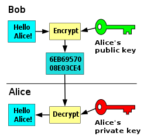
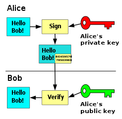
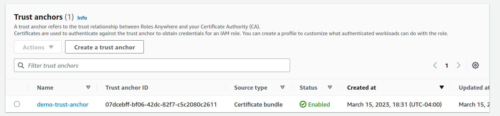
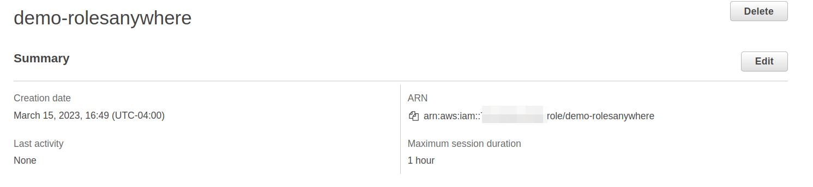
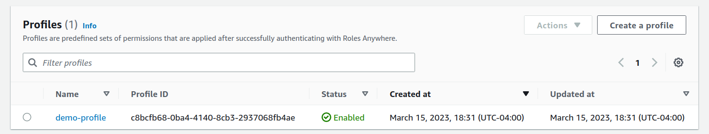

import Button from '@mui/material/Button';
import vsDark from 'prism-react-renderer/themes/vsDark';

<h1>{props.frontmatter.title}</h1>

<em>Published on {props.frontmatter.date}</em>
 
<em>Last modified on {props.frontmatter.lastModified}</em>

# Introduction

This article will introduce you to [IAM Roles Anywhere](https://docs.aws.amazon.com/rolesanywhere/latest/userguide/introduction.html), the underlying concept of public key infrastructure, and finally, a demo shell script that showcases the steps required to use IAM Role Anywhere as well as the steps required to generate certificates for it.

# Public Key Infrastructure (PKI)

Before we jump into IAM Roles Anywhere, it is important to understand some basic concepts related to PKI:

## Public-key/Asymmetric cryptography

It uses a pair of a public key (not secret) and a private key (secret). It can be used for encryption or digital verification, as illustrated by the following diagrams [from Wikipedia](https://en.wikipedia.org/wiki/File:Private_key_signing.svg)

The public key can be used to encrypt text, and the encrypted text can only be decrypted by someone who has the corresponding private key. 

Alternatively, the private key can be used to sign text, and the public key can be used to verify that the text was signed using the private key.

## Hybrid cryptography

Since asymmetric cryptography is computationally expensive, it is usually combined with symmetric cryptography. This is done by using asymmetric cryptography to encrypt and exchange a symmetric key (a single key used to both encrypt and decrypt data) which is then used to encrypt the actual data being exchanged.

## Certificate Authority (CA)

The Certificate Authority verifies that a public key is actually associated with the claimed user since the public key needs to be uncompromised (not modified by a man-in-the-middle attack for example) for asymmetric key based communication between two entities to be actually secure. It does the verification using its own private key, so it is important for any entity using the Certificate Authority for verification to already have built-in trust in the Certificate Authority.

## X.509

X.509 is an International Telecommunication Union (ITU) standard that defines the format used for public key certificates. It associates a public key with an identity using a digital signature.

# IAM Roles Anywhere

IAM Roles Anywhere use Public Key Infrastructure to verify the identity of an on-premise workload and then generate valid AWS credentials for the workload. 

## Trust Anchor

In order to use IAM Roles Anywhere, you need to register a Certificate Authority (CA) with IAM Roles Anywhere. IAM Roles Anywhere uses the term *trust anchor* for registered certificate authorities.

There are two options for Certificate Authorities with IAM Roles Anywhere:
- Use [AWS Private CA](https://docs.aws.amazon.com/privateca/latest/userguide/PcaWelcome.html) to create your own private CA managed by AWS. Make sure to review [pricing](https://aws.amazon.com/private-ca/pricing/) for AWS Private CA if you are planning to use this option since the price can be quite steep for hobby users/non-corporate users who just want to try IAM Roles Anywhere.
- Use your own external CA certificate. This will be the preferred option if you want to manage the CA on your own or if you already have a private CA used in your organization.

## IAM Role

An IAM Role is an IAM identity in an AWS account that has a specific set of permissions. Based on its trust policy, it can be assumed by whoever needs access to it. This can be an AWS service, a program, a human user, etc. based on how it is configured. IAM Roles Anywhere allows entities outside AWS to assume IAM Roles and generate temporary AWS credentials, without having to use long-term credentials which can be potentially compromised. In order for a role to be usable with IAM Roles Anywhere, it should trust `rolesanywhere.amazonaws.com` in its trust policy. More details on different trust policy configurations and how they should be restricted can be found [here](https://docs.aws.amazon.com/rolesanywhere/latest/userguide/trust-model.html#role-trusts).

**Important:** The demo script given below uses a very simple trust policy with no condition keys, but for actual production implementations, it is highly recommended to add condition keys to your trust policy.

## Profile

A profile is created in IAM Roles Anywhere to determine which Roles can be assumed by a workload through IAM Roles Anywhere. Optionally, you can also add IAM policy statements to further restrict actions that are allowed, so that the workload only has a subset of the permissions provided by the IAM Role. Note that IAM policies added here cannot be used to grant additional permissions which are not already allowed by the role, they can only restrict permissions allowed by the role.

## Requirements for Certificate Authority/Trust Anchor certificate

Certificates for your certificate authority need to fulfill the following requirements ([Reference](https://docs.aws.amazon.com/rolesanywhere/latest/userguide/trust-model.html#signature-verification)):
- The certificates MUST be X.509v3.
- Basic constraints MUST include CA: true.
- The key usage MUST include Certificate Sign, and MAY include CRL Sign. Certificate Revocation Lists (CRLs) are an optional feature of IAM Roles Anywhere.
- The signing algorithm MUST include SHA256 or stronger. MD5 and SHA1 signing algorithms are rejected.

## Requirements for end entity/client certificate

Certificates for your end entity need to fulfill the following requirements ([Reference](https://docs.aws.amazon.com/rolesanywhere/latest/userguide/trust-model.html#signature-verification)):
- The certificates MUST be X.509v3.
- Basic constraints MUST include CA: false.
- The key usage MUST include Digital Signature.
- The signing algorithm MUST include SHA256 or stronger. MD5 and SHA1 signing algorithms are rejected.

# Demo

You can find all the scripts used for the demo and supporting config files [here](https://github.com/KMK-Git/iam-roles-anywhere).

## Prerequisites:
- [openssl](https://linux.die.net/man/1/openssl)
- [jq](https://stedolan.github.io/jq/)
- [IAM Roles Anywhere credential helper](https://docs.aws.amazon.com/rolesanywhere/latest/userguide/credential-helper.html)
- [AWS CLI v2](https://docs.aws.amazon.com/cli/latest/userguide/cli-chap-getting-started.html) configured with credentials that have at least the following level of access:

export const iamPolicy = `{
    "Version": "2012-10-17",
    "Statement": [
        {
            "Sid": "IAM",
            "Effect": "Allow",
            "Action": [
                "iam:PassRole",
                "iam:CreateRole",
                "iam:DeleteRole"
            ],
            "Resource": "arn:aws:iam::*:role/demo-rolesanywhere"
        },
        {
            "Sid": "RolesAnywhere",
            "Effect": "Allow",
            "Action": [
                "rolesanywhere:DeleteTrustAnchor",
                "rolesanywhere:ListProfiles",
                "rolesanywhere:DeleteProfile",
                "rolesanywhere:ListTrustAnchors",
                "rolesanywhere:CreateTrustAnchor",
                "rolesanywhere:CreateProfile"
            ],
            "Resource": "*"
        }
    ]
}`

<CodeHighlight theme={vsDark} code={iamPolicy} language="json" />

## Generating the CA/Trust Anchor and Client certificates

The following script is used to generate:
- Private key for Certificate Authority `certificate_authority_private.key`
- Certificate for Certificate Authority `certificate_authority_cert.pem`
- Private key for client `client_private.key`
- Certificate Signing Request for client `client.csr`
- Certificate for client signed by Certificate Authority `client_cert.pem`

export const generateCertsSh = `# openssl commands are adapted from https://jimmydqv.com/iam-anywhere/
` + `
# The following files are required:
# - certificate_authority.conf Configuration for CA certificate
# - client.conf Configuration for client CSR
# - client_v3.ext Extensions file for CSR
# See repository code for samples
` + `
# Generate private key for CA
openssl genrsa -out certificate_authority_private.key 4096
# Generate certificate for CA
openssl req -new -x509 -days 365 -config certificate_authority.conf -key certificate_authority_private.key -out certificate_authority_cert.pem -extensions v3_ca
# Show certificate for CA
openssl x509 -text -noout -in certificate_authority_cert.pem
` + `
# Generate private key for client
openssl genrsa -out client_private.key 4096
# Generate Certificate Signing Request
openssl req -new -config client.conf -key client_private.key -out client.csr
# Show CSR
openssl req -text -in client.csr
# Generate certificate signed using CA
openssl x509 -req -in client.csr -CA certificate_authority_cert.pem -CAkey certificate_authority_private.key -set_serial 01 -out client_cert.pem -days 365 -sha256 -extfile client_v3.ext
# Show certificate for client
openssl x509 -text -noout -in client_cert.pem`;

<CodeHighlight theme={vsDark} code={generateCertsSh} language="shell" />

## Creating Trust Anchors and Profiles

The following script is used for the following:
- Create an IAM Roles Anywhere Trust Anchor
- Create an IAM Role
- Create an IAM Roles Anywhere Profile linking the IAM Role and IAM Roles Anywhere Trust Anchor
- Generate credentials for the IAM Role using client private key
- Use `aws sts get-caller-identity` to verify credentials

export const rolesAnywhereSh = `# Get value of CA certificate
value=\`cat certificate_authority_cert.pem\`
# Create roles anywhere trust anchor using CA certificate
trust_anchor_arn=$(aws rolesanywhere create-trust-anchor --enabled --name demo-trust-anchor --source "sourceData={x509CertificateData=$value},sourceType=CERTIFICATE_BUNDLE" --query 'trustAnchor.trustAnchorArn' --output text)
# Create IAM role which will be assumed
role_arn=$(aws iam create-role --role-name demo-rolesanywhere --assume-role-policy-document file://iam_role_trust_policy.json --query 'Role.Arn' --output text)
# Create roles anywhere profile linking trust anchor to role
profile_arn=$(aws rolesanywhere create-profile --enabled --name demo-profile --role-arns "$role_arn" --query 'profile.profileArn' --output text)
# Sleep to allow above changes to propogate
echo "Sleeping for 20 seconds"
sleep 20
# Generate credentials
credentials=$(./aws_signing_helper credential-process \\
    --certificate client_cert.pem \\
    --private-key client_private.key \\
    --trust-anchor-arn $trust_anchor_arn \\
    --profile-arn $profile_arn \\
    --role-arn $role_arn)
access_key_id=$(echo $credentials | jq -r ".AccessKeyId")
secret_access_key=$(echo $credentials | jq -r ".SecretAccessKey")
session_token=$(echo $credentials | jq -r ".SessionToken")
# Verify credentials
AWS_ACCESS_KEY_ID=$access_key_id AWS_SECRET_ACCESS_KEY=$secret_access_key AWS_SESSION_TOKEN=$session_token aws sts get-caller-identity`

<CodeHighlight theme={vsDark} code={rolesAnywhereSh} language="shell" />

## Cleanup created resources

The following script is used for the following:
- Remove all private keys, certificates and CSR files
- Delete the IAM Roles Anywhere Profile
- Delete the IAM Role
- Delete the IAM Roles Anywhere Trust Anchor

export const cleanupSh = `# Remove all private keys, certificates and CSR
rm *.key
rm *.pem
rm *.csr
# Get profile ID using name
profile_id=$(aws rolesanywhere list-profiles --query 'profiles[?name==\`demo-profile\`].profileId' --output text)
# Get trust anchor ID using name
trust_anchor_id=$(aws rolesanywhere list-trust-anchors --query 'trustAnchors[?name==\`demo-trust-anchor\`].trustAnchorId' --output text)
# Delete profile
aws rolesanywhere delete-profile --profile-id $profile_id
# Delete role
aws iam delete-role --role-name demo-rolesanywhere
# Delete trust anchor
aws rolesanywhere delete-trust-anchor --trust-anchor-id $trust_anchor_id`

<CodeHighlight theme={vsDark} code={cleanupSh} language="shell" />

# Disclaimer

While IAM Roles Anywhere does not use traditional long-lived AWS credentials like those associated with an IAM user, it still relies on the private key for your certificates remaining secret. It is important that your CA or client private keys are not compromised, otherwise, it is possible for an attacker to generate AWS credentials for your account.

# References
- https://en.wikipedia.org/wiki/Public-key_cryptography
- https://en.wikipedia.org/wiki/Public_key_infrastructure
- https://en.wikipedia.org/wiki/X.509
- https://docs.aws.amazon.com/rolesanywhere/latest/userguide/public-key-infrastructure.html
- https://docs.aws.amazon.com/rolesanywhere/latest/userguide/introduction.html
- https://docs.aws.amazon.com/IAM/latest/UserGuide/id_roles.html
- https://jimmydqv.com/iam-anywhere/