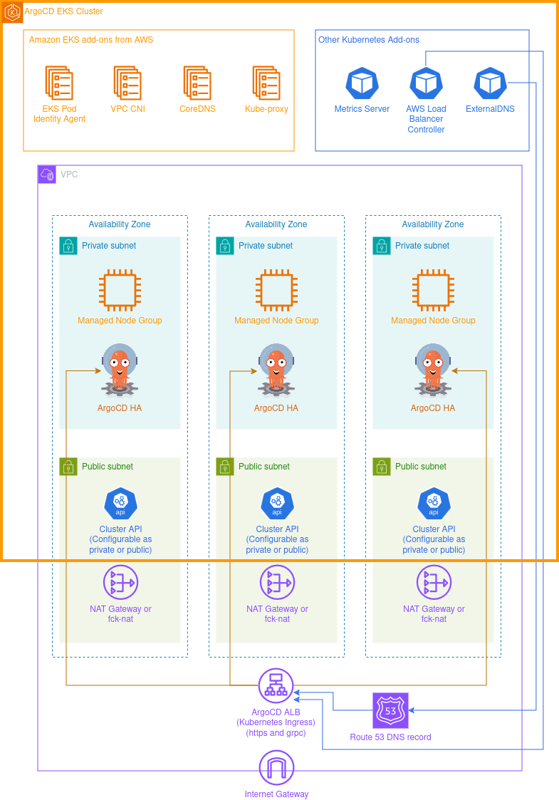
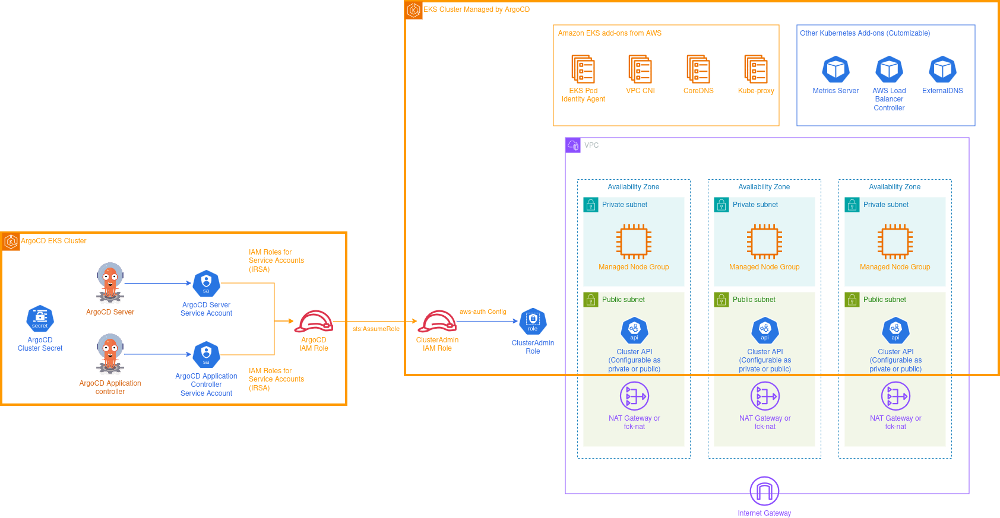

import Button from '@mui/material/Button';
import { themes } from 'prism-react-renderer';

<h1>{props.pageContext.frontmatter.title}</h1>

<em>Published on {props.pageContext.frontmatter.date}</em>
 
<em>Last modified on {props.pageContext.frontmatter.lastModified}</em>

# Introduction

This article will explain the boilerplate template code I developed for creating EKS Clusters with deployments managed by ArgoCD. The boilerplate provides a quick starting point for creating an EKS Cluster with ArgoCD preconfigured and other best practices.

<Button variant="contained" style={{"margin": "1em", "minWidth": "36.5px", "backgroundColor": "#007CBD"}}><a href="https://github.com/KMK-Git/eks-argocd-starter/" target="_blank" rel="noopener noreferrer" style={{"color": "#FFFFFF"}}>Repository link</a></Button>

The template primarily uses Terraform and Helm for the cluster deployment. It was originally developed as a way for me to learn some Kubernetes and ArgoCD concepts using an Amazon EKS Cluster but quickly morphed into a more generic template that I plan to use for future Amazon EKS-based projects.

# Target Audience

This article is targeted at readers who have worked with Kubernetes. A basic understanding of the tools listed in the next section will also be required.

# Technology Stack

Before diving into the code, here is a brief description of all major tools and frameworks used for this boilerplate:

## Amazon Elastic Kubernetes Service (Amazon EKS)

[Amazon EKS](https://aws.amazon.com/eks/) is AWS's managed offering for Kubernetes. Amazon EKS provides a Kubernetes environment where AWS primarily manages the control plane. Amazon EKS can deploy to on-prem or AWS outposts, but this template is for cloud deployments.

## Terraform

[Terraform](https://www.terraform.io/) is an Infrastructure as Code tool by Hashicorp which can be used to manage cloud and other infrastructure using declarative configuration files.

## Helm

[Helm](https://helm.sh/) is a tool used to package Kubernetes deployments in the form of charts and manage the deployment of these charts to any Kubernetes cluster. Vanilla Kubernetes deploys resources in a cluster declaratively using YAML or JSON manifest files. Helm builds on top of this by defining charts. The charts consist of one or more templates as well as input parameters.

## GitHub Actions

[GitHub Actions](https://github.com/features/actions) is a workflow automation framework which is directly integrated with GitHub. It define a CI/CD pipeline for any repository.

## ArgoCD

Copying the exact definition from the [ArgoCD website](https://argo-cd.readthedocs.io/en/stable/): Argo CD is a declarative, GitOps continuous delivery tool for Kubernetes. Let's analyze each word in this definition:  
**GitOps:** Files stored in a Git repository define the desired state for resources deployed to a Kubernetes cluster.  
**Declarative:** Declarative configurations such as Helm charts, Kustomize applications, or even plain JSON or YAML Kubernetes manifests are supported by ArgoCD.  
**Continuous Delivery:** Configuration changes pushed to the Git repo are immediately deployed (auto sync or manual sync can be configured).

# Boilerplate Template Structure

The Terraform code is divided into three modules:
- VPC Deployment: Create VPC Networking resources required for the clusters.
- Central EKS Cluster: ArgoCD is deployed in this cluster.
- Managed EKS Cluster: ArgoCD manages deployments in this cluster. Multiple managed clusters can be created.

Each Terraform module has three workflows: Terraform Plan, Terraform Apply, and Terraform Destroy. Authentication for the GitHub actions is done by integrating [GitHub's OIDC provider](https://docs.github.com/en/actions/security-for-github-actions/security-hardening-your-deployments/configuring-openid-connect-in-amazon-web-services). S3 is used as a backend to store the Terraform state. 

## VPC Deployment [Repository Folder](https://github.com/KMK-Git/eks-argocd-starter/tree/main/networking-terraform)

The Terraform module creates a generic VPC with a configurable number of public and private subnets.

**Public Subnets:** The subnets route to Internet Gateway, and can be used to create resources with public IP. The subnets can be configured to have one NAT Gateway across all subnets or one NAT Gateway per AZ. The NAT Gateway can be an [AWS managed NAT Gateway](https://docs.aws.amazon.com/vpc/latest/userguide/vpc-nat-gateway.html) or a cheaper NAT instance using [fck-NAT](https://fck-nat.dev/stable/).

**Private Subnets:** The subnets route to NAT Gateway (if public subnets are configured to have NAT) or are isolated if there is no NAT Gateway.

export const networking = `module "vpc" {
  source = "git::https://github.com/terraform-aws-modules/terraform-aws-vpc.git?ref=e226cc15a7b8f62fd0e108792fea66fa85bcb4b9"

  name = "\${var.name_prefix}vpc"
  cidr = var.vpc_cidr

  azs                     = var.availability_zones
  private_subnets         = var.vpc_private_cidrs
  public_subnets          = var.vpc_public_cidrs
  map_public_ip_on_launch = true

  enable_dns_support   = true
  enable_dns_hostnames = true

  enable_nat_gateway     = var.use_managed_nat
  single_nat_gateway     = var.use_managed_nat ? !var.use_ha_nat : null
  one_nat_gateway_per_az = var.use_managed_nat ? var.use_ha_nat : null
}

module "fcknat" {
  count     = var.use_managed_nat ? 0 : (var.use_ha_nat ? length(var.availability_zones) : 1)
  source    = "git::https://github.com/RaJiska/terraform-aws-fck-nat.git?ref=9377bf9247c96318b99273eb2978d1afce8cf0eb"
  name      = "fck-nat"
  vpc_id    = module.vpc.vpc_id
  subnet_id = module.vpc.public_subnets[count.index]
  ha_mode   = true # Enables high-availability mode

  update_route_tables = true
  route_tables_ids    = { for idx, route_table_id in module.vpc.private_route_table_ids : idx => route_table_id }
}`;

<CodeHighlight theme={themes.vsDark} code={networking} language="hcl" />

**Major Dependencies:**
- [Terraform AWS VPC module](https://registry.terraform.io/modules/terraform-aws-modules/vpc/aws/latest)
- [fck-NAT](https://fck-nat.dev/stable/) via [fck-NAT Terraform module](https://registry.terraform.io/modules/RaJiska/fck-nat/aws/latest)

## Central EKS Cluster [Repository Folder](https://github.com/KMK-Git/eks-argocd-starter/tree/main/central-eks-terraform)

The Terraform module creates an Amazon EKS Cluster with an ArgoCD deployment.

**EKS Cluster:** The configuration for the cluster is opinionated. Some of the major points: 
- CoreDNS, EKS Pod Identity Agent, KubeProxy, and VPC CNI are configured as EKS cluster addons. The VPC CNI is configured to use custom networking.
- An EKS Managed Node group with three instances, one per AZ.

Depending on the exact requirements, the configuration can be updated.

export const centralCluster = `module "central_eks" {
  source = "git::https://github.com/terraform-aws-modules/terraform-aws-eks.git?ref=c60b70fbc80606eb4ed8cf47063ac6ed0d8dd435"

  cluster_name    = var.central_eks_cluster.cluster_name
  cluster_version = var.central_eks_cluster.cluster_version

  cluster_endpoint_public_access       = var.central_eks_cluster.publicly_accessible_cluster
  cluster_endpoint_public_access_cidrs = var.central_eks_cluster.publicly_accessible_cluster ? var.central_eks_cluster.publicly_accessible_cluster_cidrs : null

  cluster_addons = {
    coredns = {
      most_recent = true
    }
    eks-pod-identity-agent = {
      before_compute = true
      most_recent    = true
    }
    kube-proxy = {
      before_compute = true
      most_recent    = true
    }
    vpc-cni = {
      before_compute = true
      most_recent    = true
      configuration_values = jsonencode({
        eniConfig = var.eks_vpc_cni_custom_networking ? {
          create  = true
          region  = data.aws_region.current.name
          subnets = { for az, subnet_id in local.cni_az_subnet_map : az => { securityGroups : [module.central_eks.node_security_group_id], id : subnet_id } }
        } : null
        env = {
          AWS_VPC_K8S_CNI_CUSTOM_NETWORK_CFG = var.eks_vpc_cni_custom_networking ? "true" : "false"
          ENI_CONFIG_LABEL_DEF               = "topology.kubernetes.io/zone"
      } })
    }
  }

  vpc_id                   = data.aws_vpc.vpc.id
  subnet_ids               = local.private_subnet_ids
  control_plane_subnet_ids = local.public_subnet_ids
  cluster_ip_family        = var.cluster_ip_family

  # Cluster access entry
  # To add the current caller identity as an administrator
  enable_cluster_creator_admin_permissions = true

  eks_managed_node_groups = {
    nodegroup = {
      instance_types = ["m6i.large"]

      min_size     = 3
      max_size     = 3
      desired_size = 3

      subnet_ids = local.private_subnet_ids
    }
  }
  access_entries = {
    ssorole = {
      kubernetes_groups = []
      principal_arn     = "arn:\${data.aws_partition.current.partition}:iam::\${data.aws_caller_identity.current.account_id}:role/aws-reserved/sso.amazonaws.com/\${var.sso_cluster_admin_role_name}"

      policy_associations = {
        example = {
          policy_arn = "arn:\${data.aws_partition.current.partition}:eks::aws:cluster-access-policy/AmazonEKSClusterAdminPolicy"
          access_scope = {
            type = "cluster"
          }
        }
      }
    }
  }
  cluster_upgrade_policy = {
    support_type = var.central_eks_cluster.cluster_support_type
  }
}`;

<CodeHighlight theme={themes.vsDark} code={centralCluster} language="hcl" />

**AWS Certificate Manager (ACM) Certificate for ArgoCD:** The SSL certificate in ACM is created using Terraform, and validation records are added to Route 53.

export const centralClusterACM = `resource "aws_acm_certificate" "argocd" {
  domain_name       = local.argocd_hostname
  validation_method = "DNS"
  lifecycle {
    create_before_destroy = true
  }
}

data "aws_route53_zone" "argocd" {
  name         = var.argocd_domainname
  private_zone = false
}

resource "aws_route53_record" "argocd" {
  for_each = {
    for dvo in aws_acm_certificate.argocd.domain_validation_options : dvo.domain_name => {
      name   = dvo.resource_record_name
      record = dvo.resource_record_value
      type   = dvo.resource_record_type
    }
  }

  allow_overwrite = true
  name            = each.value.name
  records         = [each.value.record]
  ttl             = 60
  type            = each.value.type
  zone_id         = data.aws_route53_zone.argocd.zone_id
}

resource "aws_acm_certificate_validation" "argocd" {
  certificate_arn         = aws_acm_certificate.argocd.arn
  validation_record_fqdns = [for record in aws_route53_record.argocd : record.fqdn]
}`;

<CodeHighlight theme={themes.vsDark} code={centralClusterACM} language="hcl" />

**ArgoCD Service Account:** A Service Account created specifically for ArgoCD Application Controller and ArgoCD Server. This Service Account will have access to other clusters where ArgoCD will be managing deployments. This is done by having the underlying AWS IAM Role for the Service Account ([IRSA](https://docs.aws.amazon.com/eks/latest/userguide/iam-roles-for-service-accounts.html)) assume another IAM Role with cluster admin permissions for the other cluster.

export const centralClusterSA = `module "controller_role" {
  source = "git::https://github.com/terraform-aws-modules/terraform-aws-iam.git//modules/iam-role-for-service-accounts-eks?ref=89fe17a6549728f1dc7e7a8f7b707486dfb45d89"

  role_name = "\${var.name_prefix}ManagementRole"

  policy_name_prefix = var.name_prefix

  oidc_providers = {
    main = {
      provider_arn               = module.central_eks.oidc_provider_arn
      namespace_service_accounts = ["argocd:argocd-application-controller", "argocd:argocd-server"]
    }
  }
}`;

<CodeHighlight theme={themes.vsDark} code={centralClusterSA} language="hcl" />

**EKS Blueprint Addons:** The following addons are added to the cluster using the Blueprints module:
- [ArgoCD](https://argo-cd.readthedocs.io/en/stable/): Highly Available (HA) deployment configured using Helm values.
- [AWS Load Balancer Controller](https://kubernetes-sigs.github.io/aws-load-balancer-controller/latest/): Used to create an Application Load Balancer for ArgoCD.
- [ExternalDNS](https://kubernetes-sigs.github.io/external-dns/latest/): Used to create Route 53 DNS records for ArgoCD Application Load Balancer.
- [Kubernetes Metrics Server](https://kubernetes-sigs.github.io/metrics-server/): Track container resource metrics.

export const centralClusterBlueprint = `module "eks_blueprints_addons" {
  depends_on = [module.central_eks]
  source     = "git::https://github.com/aws-ia/terraform-aws-eks-blueprints-addons.git?ref=a9963f4a0e168f73adb033be594ac35868696a91"

  cluster_name      = module.central_eks.cluster_name
  cluster_endpoint  = module.central_eks.cluster_endpoint
  cluster_version   = module.central_eks.cluster_version
  oidc_provider_arn = module.central_eks.oidc_provider_arn

  enable_argocd                       = true
  enable_aws_load_balancer_controller = true
  enable_metrics_server               = true
  enable_external_dns                 = true
  external_dns_route53_zone_arns      = [data.aws_route53_zone.argocd.arn]
  argocd = {
    chart_version = "7.4.5"
    values        = [file("\${path.module}/helmvalues/argocd.yaml")]
    set = [
      {
        name  = "controller.serviceAccount.annotations.eks\\.amazonaws\\.com/role-arn"
        value = module.controller_role.iam_role_arn
      },
      {
        name  = "server.serviceAccount.annotations.eks\\.amazonaws\\.com/role-arn"
        value = module.controller_role.iam_role_arn
      }
    ]
  }
}`;

<CodeHighlight theme={themes.vsDark} code={centralClusterBlueprint} language="hcl" />

**ArgoCD ingress (AWS Application Load Balancer):** An Ingress object with routes for HTTPS (UI) and gRPC (CLI). The AWS Load Balancer Controller creates an AWS Application Load Balancer corresponding to the ingress object and associates the ACM Certificate with the Load Balancer. ExternalDNS reads the domain name specified for the Load Balancer and creates the required Route53 records. A sleep is added to wait for the AWS Load Balancer Controller deployment to complete before the ingress deployment is attempted.

export const centralClusterIngress = `resource "time_sleep" "wait_lb_controller_deployment" {
  depends_on      = [module.eks_blueprints_addons]
  create_duration = "60s"
}

resource "helm_release" "argocdingress" {
  depends_on = [aws_acm_certificate_validation.argocd, time_sleep.wait_lb_controller_deployment]
  name       = "argocdingress"
  chart      = "\${path.module}/../charts/argocdingress"
  namespace  = "argocd"
  version    = "0.10.0"

  set {
    name  = "argocdlb.hostname"
    value = local.argocd_hostname
  }

  set {
    name  = "argocdlb.certificatearn"
    value = aws_acm_certificate.argocd.arn
  }

  set {
    name  = "argocdlb.subnetlist"
    value = join("\\,", local.public_subnet_ids)
  }
}`;

<CodeHighlight theme={themes.vsDark} code={centralClusterIngress} language="hcl" />

**Major Dependencies:**
- [Terraform AWS EKS module](https://registry.terraform.io/modules/terraform-aws-modules/eks/aws/latest)
- [Terraform AWS EKS Blueprints Addons](https://aws-ia.github.io/terraform-aws-eks-blueprints-addons/main/)

## Managed EKS Cluster [Repository Folder](https://github.com/KMK-Git/eks-argocd-starter/tree/main/managed-eks-terraform)

The Terraform module creates an Amazon EKS Cluster where deployments can be done using the ArgoCD server deployed to the Central EKS Cluster.

**EKS Cluster:** The configuration for the cluster is opinionated. Some of the major points: 
- CoreDNS, EKS Pod Identity Agent, KubeProxy, and VPC CNI are configured as EKS Cluster addons. The VPC CNI is configured to use custom networking.
- An EKS Managed Node group with three instances, one per AZ.

Depending on the exact requirements, the configuration can be updated.

export const managedCluster = `module "managed_eks" {
  source = "git::https://github.com/terraform-aws-modules/terraform-aws-eks.git?ref=c60b70fbc80606eb4ed8cf47063ac6ed0d8dd435"

  cluster_name    = var.managed_eks_cluster.cluster_name
  cluster_version = var.managed_eks_cluster.cluster_version

  cluster_endpoint_public_access       = var.managed_eks_cluster.publicly_accessible_cluster
  cluster_endpoint_public_access_cidrs = var.managed_eks_cluster.publicly_accessible_cluster ? var.managed_eks_cluster.publicly_accessible_cluster_cidrs : null

  cluster_addons = {
    coredns = {
      most_recent = true
    }
    eks-pod-identity-agent = {
      before_compute = true
      most_recent    = true
    }
    kube-proxy = {
      before_compute = true
      most_recent    = true
    }
    vpc-cni = {
      before_compute = true
      most_recent    = true
      configuration_values = jsonencode({
        eniConfig = var.eks_vpc_cni_custom_networking ? {
          create  = true
          region  = data.aws_region.current.name
          subnets = { for az, subnet_id in local.cni_az_subnet_map : az => { securityGroups : [module.managed_eks.node_security_group_id], id : subnet_id } }
        } : null
        env = {
          AWS_VPC_K8S_CNI_CUSTOM_NETWORK_CFG = var.eks_vpc_cni_custom_networking ? "true" : "false"
          ENI_CONFIG_LABEL_DEF               = "topology.kubernetes.io/zone"
      } })
    }
  }

  vpc_id                   = data.aws_vpc.vpc.id
  subnet_ids               = local.private_subnet_ids
  control_plane_subnet_ids = local.public_subnet_ids
  cluster_ip_family        = var.cluster_ip_family

  # Cluster access entry
  # To add the current caller identity as an administrator
  enable_cluster_creator_admin_permissions = true

  eks_managed_node_groups = {
    nodegroup = {
      instance_types = ["m6i.large"]

      min_size     = 3
      max_size     = 3
      desired_size = 3

      subnet_ids = local.private_subnet_ids
    }
  }
  access_entries = {
    ssorole = {
      kubernetes_groups = []
      principal_arn     = "arn:\${data.aws_partition.current.partition}:iam::\${data.aws_caller_identity.current.account_id}:role/aws-reserved/sso.amazonaws.com/\${var.sso_cluster_admin_role_name}"

      policy_associations = {
        example = {
          policy_arn = "arn:\${data.aws_partition.current.partition}:eks::aws:cluster-access-policy/AmazonEKSClusterAdminPolicy"
          access_scope = {
            type = "cluster"
          }
        }
      }
    }
    argocdrole = {
      kubernetes_groups = []
      principal_arn     = aws_iam_role.argocd_admin_role.arn

      policy_associations = {
        example = {
          policy_arn = "arn:\${data.aws_partition.current.partition}:eks::aws:cluster-access-policy/AmazonEKSClusterAdminPolicy"
          access_scope = {
            type = "cluster"
          }
        }
      }
    }
  }
  cluster_upgrade_policy = {
    support_type = var.managed_eks_cluster.cluster_support_type
  }
  # Allow central cluster to access api endpoint
  cluster_security_group_additional_rules = {
    "central_cluster_to_managed_cluster" = {
      description              = "cluster api access"
      protocol                 = "tcp"
      from_port                = 443
      to_port                  = 443
      type                     = "ingress"
      source_security_group_id = data.aws_security_group.central_cluster_node.id
    }
  }
}`;

<CodeHighlight theme={themes.vsDark} code={managedCluster} language="hcl" />

**EKS Blueprint Addons:** The following addons can be added to the cluster using the Blueprints module:
- [AWS Load Balancer Controller](https://kubernetes-sigs.github.io/aws-load-balancer-controller/latest/): Used to create AWS Load Balancers.
- [ExternalDNS](https://kubernetes-sigs.github.io/external-dns/latest/): Used to create Route 53 DNS records.
- [Kubernetes Metrics Server](https://kubernetes-sigs.github.io/metrics-server/): Track container resource metrics.

The Addons listed here are optional and their deployment can be controlled through Terraform variables. The Blueprint module is highly configurable, and more addons supported by the module can be added if required.

export const managedClusterBlueprint = `data "aws_route53_zone" "route53_zones" {
  for_each     = toset(var.route53_zone_names)
  name         = each.value
  private_zone = false
}

module "eks_blueprints_addons" {
  depends_on = [module.managed_eks]
  source     = "git::https://github.com/aws-ia/terraform-aws-eks-blueprints-addons.git?ref=a9963f4a0e168f73adb033be594ac35868696a91"

  cluster_name      = module.managed_eks.cluster_name
  cluster_endpoint  = module.managed_eks.cluster_endpoint
  cluster_version   = module.managed_eks.cluster_version
  oidc_provider_arn = module.managed_eks.oidc_provider_arn

  enable_aws_load_balancer_controller = var.enable_aws_load_balancer_controller
  enable_metrics_server               = var.enable_metrics_server
  enable_external_dns                 = var.enable_external_dns
  external_dns_route53_zone_arns      = var.enable_external_dns ? data.aws_route53_zone.route53_zones[*].arn : []
}`;

<CodeHighlight theme={themes.vsDark} code={managedClusterBlueprint} language="hcl" />

**Cluster Admin IAM Role**: An IAM role added as cluster admin to the managed EKS cluster. This role has a trust policy which allows it to be assumed by the ArgoCD Service Account via [IRSA](https://docs.aws.amazon.com/eks/latest/userguide/iam-roles-for-service-accounts.html). An IAM policy is also added to the ArgoCD IAM role so that it can assume the cluster admin IAM Role.

export const managedClusterRole = `resource "aws_iam_role" "argocd_admin_role" {
  name = "\${var.name_prefix}ArgoCDAdminRole"

  assume_role_policy = jsonencode({
    Version = "2012-10-17"
    Statement = [
      {
        Action = "sts:AssumeRole"
        Effect = "Allow"
        Principal = {
          AWS = data.aws_iam_role.argocd_service_account.arn
        }
      },
    ]
  })
}

resource "aws_iam_policy" "argocd_admin_assume_role_policy" {
  name        = "\${var.name_prefix}ArgoCDAdminAssumeRole"
  description = "Allow ArgoCD service account to assume cluster admin role"
  policy = jsonencode({
    Version = "2012-10-17"
    Statement = [
      {
        Action = [
          "sts:AssumeRole",
        ]
        Effect   = "Allow"
        Resource = aws_iam_role.argocd_admin_role.arn
      },
    ]
  })
}

resource "aws_iam_role_policy_attachment" "argocd_admin_assume_role_policy_attachment" {
  role       = data.aws_iam_role.argocd_service_account.name
  policy_arn = aws_iam_policy.argocd_admin_assume_role_policy.arn
}`;

<CodeHighlight theme={themes.vsDark} code={managedClusterRole} language="hcl" />

**Secret with Managed Cluster details:** The secret consists of:
- EKS Cluster ARN
- EKS Cluster name
- EKS Cluster endpoint
- EKS Cluster Certificate Authority data
- Cluster Admin IAM Role ARN

ArgoCD uses these details to connect to the cluster and deploy to it.

export const managedClusterSecret = `resource "helm_release" "argocdmanagedcluster" {
  provider         = helm.argocdcluster
  depends_on       = [module.managed_eks, aws_iam_role_policy_attachment.argocd_admin_assume_role_policy_attachment]
  name             = module.managed_eks.cluster_name
  chart            = "\${path.module}/../charts/argocdmanagedcluster"
  namespace        = "argocd"
  version          = "0.1.0"
  create_namespace = true
  set {
    name  = "cluster.name"
    value = module.managed_eks.cluster_name
  }
  set {
    name  = "cluster.role_arn"
    value = aws_iam_role.argocd_admin_role.arn
  }
  set {
    name  = "cluster.ca_data"
    value = module.managed_eks.cluster_certificate_authority_data
  }
  set {
    name  = "cluster.arn"
    value = module.managed_eks.cluster_arn
  }
  set {
    name  = "cluster.endpoint"
    value = module.managed_eks.cluster_endpoint
  }
}`;

<CodeHighlight theme={themes.vsDark} code={managedClusterSecret} language="hcl" />

**Major Dependencies:**
- [Terraform AWS EKS module](https://registry.terraform.io/modules/terraform-aws-modules/eks/aws/latest)
- [Terraform AWS EKS Blueprints Addons](https://aws-ia.github.io/terraform-aws-eks-blueprints-addons/main/)

